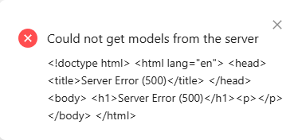
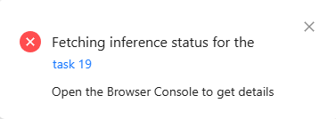

# [25.08.13] 

## ▶️ VL
- Nuclio funtion 배포 완료
- CVAT Auto annotation(라벨링) 테스트 성공 
 
- 수집한 데이터(회사 내부 + 산업분야)를 한번에 진행하기에는 너무 많은 리소스가 소모됨에 따라, 적당량 나누어 라벨링 진행 중 
<br>
- **배포 관련 정리** : 
   -  Nuclio 배포 폴더 구조
      cvat/serverless/custom-coco-yolov8m/nuclio/
      ├─ [function.yaml](cvat/serverless/custom-coco-yolov8m/nuclio/function.yaml)
      ├─ [main.py](cvat/serverless/custom-coco-yolov8m/nuclio/main.py)
      ├─ [model_handler.py](cvat/serverless/custom-coco-yolov8m/nuclio/model_handler.py)
      └─ yolov8m.onnx
      - v8m 모델은 pt -> onnx 변환하여 사용(CPU 환경, 빌드 작고 빠름)

         **`bash`**
         ```bash      
         yolo export model=yolov8m.pt format=onnx opset=12 dynamic=True imgsz=640
   - Nuclio 배포
      - deploy_cpu.sh를 이용하여 진행. 배포 컨텐츠는 nuclio 하위에 있어야 함

         **`bash`**
         ```bash
         ./serverless/deploy_cpu.sh serverless/custom-coco-yolov8m
   - CVAT에서 Auto annotation을 위한 system model로 사용
   <br>
- **❗트러블슈팅 간략 요약**
   - **numpy.core.multiarray failed** → numpy < 2 + opencv-python-headless\==4.9.0.80 + onnxruntime==1.18.0
   - **CVAT - Could not get models ...** 
   
      - 원인 : function.yaml의 metadata.annotations에 필수 키가 빠짐 또는 spec JSON 파싱 실패.
      - 해결 방법
         - metadata.annotations에 `name`, `type(detector)`, `description` 속성에 대한 값 추가
         - spec은 **블록 문자열(|)**로 감싼 유효 JSON 사용(따옴표/줄바꿈 이슈 방지)
         - metadata.namespace: cvat, Nuclio 프로젝트 이름도 cvat

            **`yaml`**
            ```yaml
            metadata:
               name: coco-yolov8m-onnx
               namespace: cvat
               annotations:
                  name: YOLO v8m (ONNX)
                  type: detector
                  description: COCO 80-class detector (ONNXRuntime)
                  spec: |
                     [ {"id":0,"name":"person","type":"rectangle"}, ... ]
      
         <br>
   - **CVAT - Fetching inference status ...**
   
      - 원인 : Nuclio handler 내부 예외
         - (input) `event.body`의 타입이`bytes` or `str` or `dict`로 달라질 수 있음
         - (output) YOLO를 ONNX로 변환하게 되면 예측 텐서의 형태(shape)가 제각각임
      - 해결 방법
         - main.py에서 안전 파서(parser) 적용
            - Nuclio 쪽(json)에서 py 객체로 건네줄 때의 자료형이 `bytes`, `str`, `dict` 중 하나로 달라 질 수 있음에 따라 event.body로 부터 들어오는 형태에 따라 처리

               **`python`**
               ```python
               def _get_payload(event):
                  b = event.body
                  if isinstance(b, (bytes, bytearray)):
                     return json.loads(b.decode("utf-8", errors="ignore"))
                  if isinstance(b, str):
                     return json.loads(b)
                  return b  # already dict         
            - 핸들러에서 data = _get_payload(event)로 받아 사용
         - Onnx 출력 정규화/후처리
            - ONNX 출력의 모양을 어떤 경우든 (N, D)로 통일
               - (1,84,8400) / (1,85,8400) → 전치·squeeze → (8400,84/85)
               - (1,8400,84/85) → squeeze → (8400,84/85)
               - (84/85, N) → 전치 → (N,84/85)
            - 84/85 분기
               - D\==84: 4(box) + 80(class) → score = max(class_scores)
               - D\==85: 4 + obj + 80 → score = obj * max(class_scores)
            - [cx,cy,w,h] → [x1,y1,x2,y2] 변환
            - letterbox 역보정(r, dx, dy) + 원본 크기로 clip
            - NMS 후 CVAT 포맷으로 반환
            - 해당 내용 [model_handler.py](cvat/serverless/custom-coco-yolov8m/nuclio/model_handler.py)에 적용
        

## ▶️ ON
 - 금일 진행사항 없음


### ✅ TODO list
 - 이미지 라벨링 및 학습 진행
   - CVAT 오토 어노테이션(라벨링) 진행
      - 회사 내부, 산업분야
      - 라벨링 정보 보완(산업 분야 관련)
   - yolov11n 학습
 - 데이터(전압, 전류) 추가 수령 후 분석 진행

 <!-- VS code로 확인 가능, 단축키 : ctrl + shift + v -->